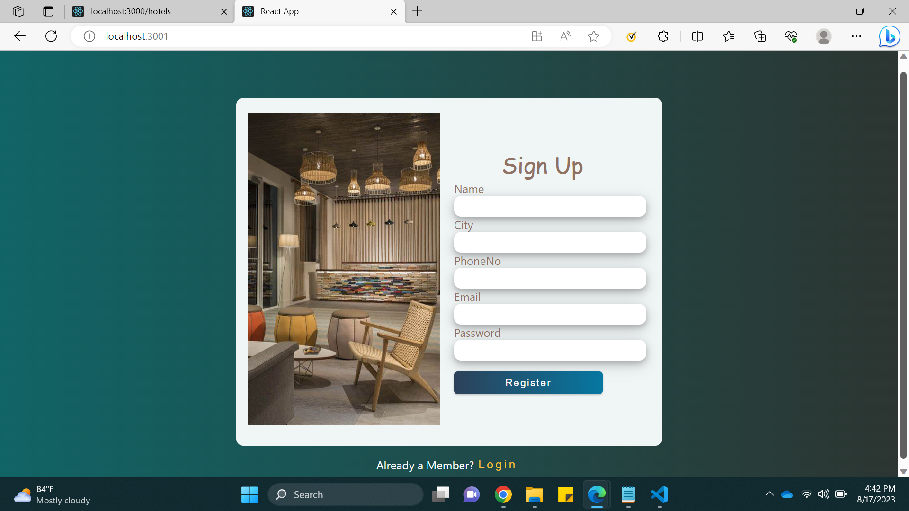
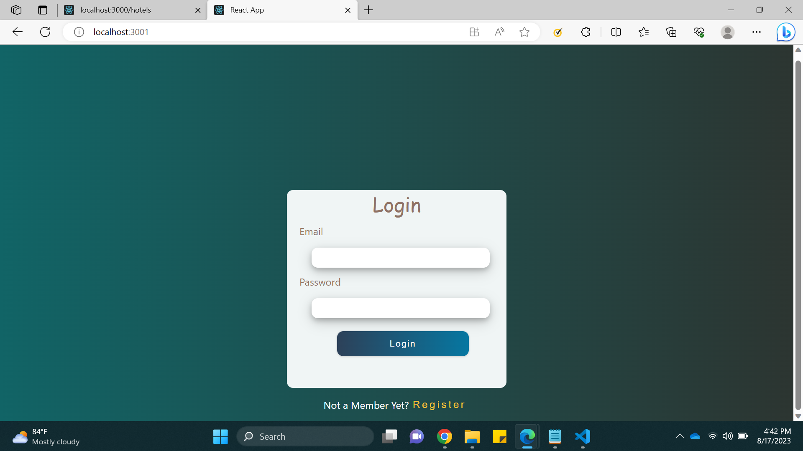
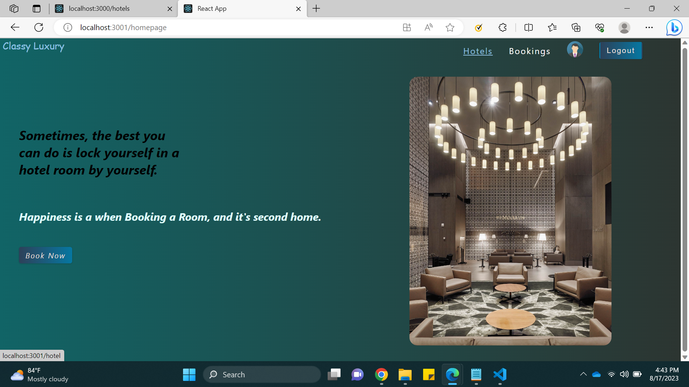
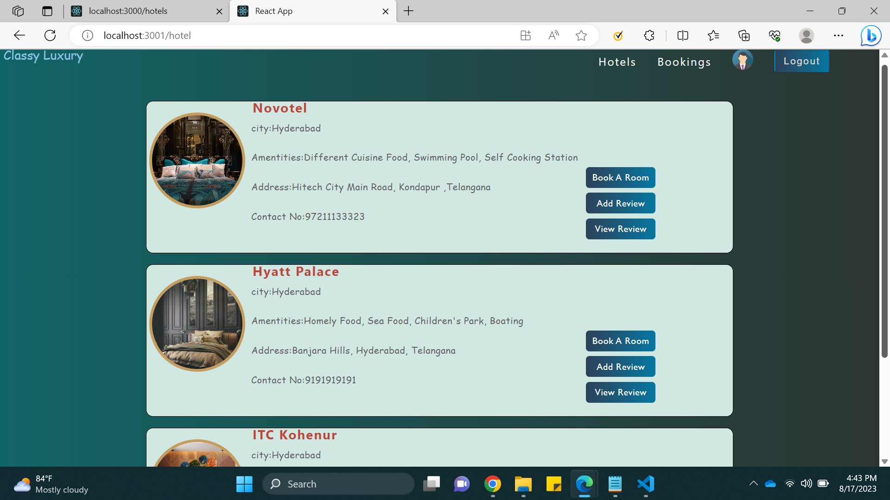
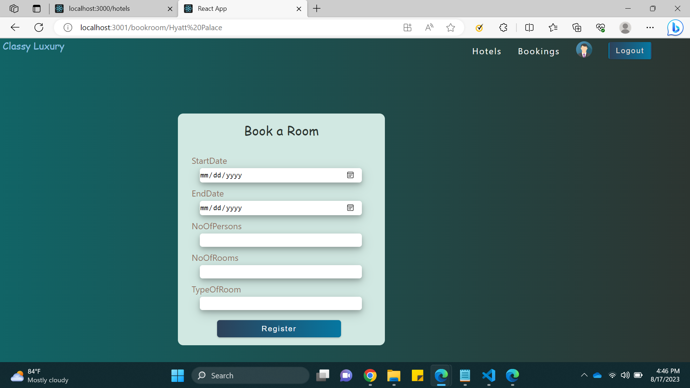
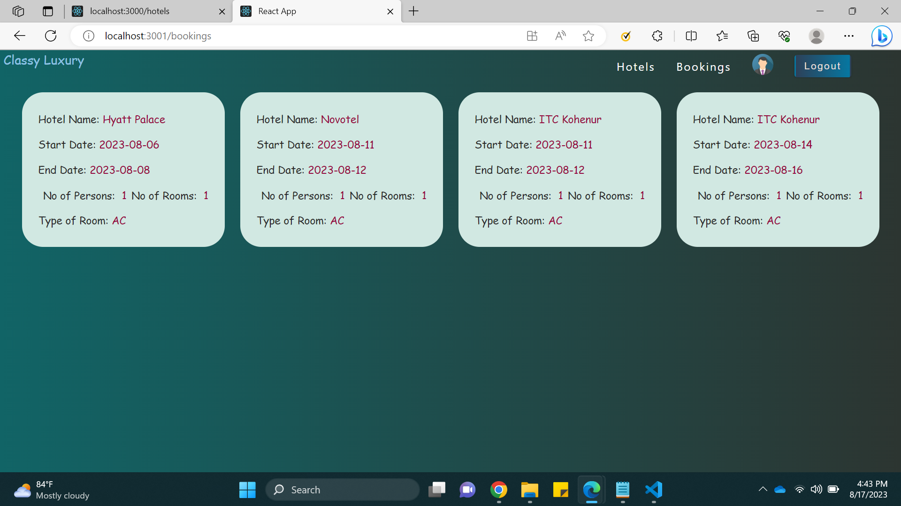
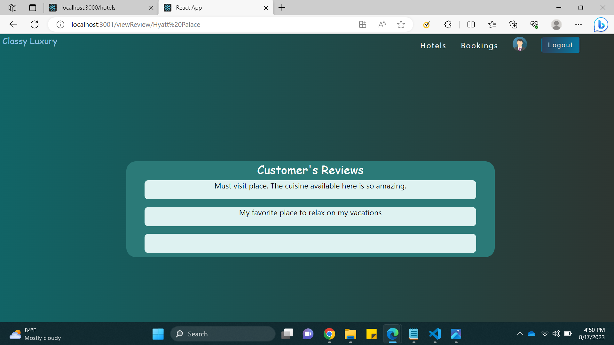
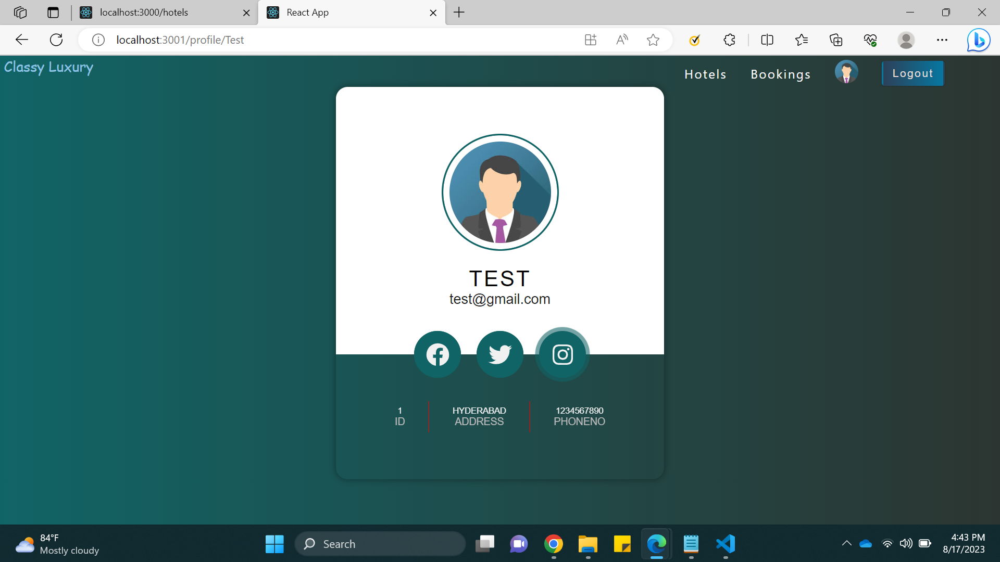

ClassyLuxury is a hotel Booking application. where user need to Create & Login to his Account. this Application helps user to get the details of the hotels in the city. here user can Book a room, Add reviews to the selected Hotel & can able to see the reviews of the hotel.
Here we used Get,Post,Patch API. And added Authentication for the Application

## Note

In this Project JSON will be the server.
Run the JSON server and npm start in seperate terminals

### `JSON server`

```jsx
 npx json-server --watch db.json
```

Open [http://localhost:3000](http://localhost:3000) to view it in your browser.

### `npm start`

```jsx
 npm start
```

Open [http://localhost:3001](http://localhost:3001) to view it in your browser.

## Screenshots of Final Output

- SignUp Page
  

- Login Page
  

- HomePage
  

- Hotels Page
  

- Bookroom Page
  

- View Bookings Page
  

- viewReviews Page
  

- Profile Page
  

## Styled Components

[Styled-Components - Main Docs](https://styled-components.com/)

```jsx
import styled from "styled-components";

const ReactComponent = () => {
 // logic here
 return <Wrapper>
 {some content}
 </Wrapper>
}


const Wrapper = styled.htmlElement`
write your styles here
`
export default ReactComponent
```
